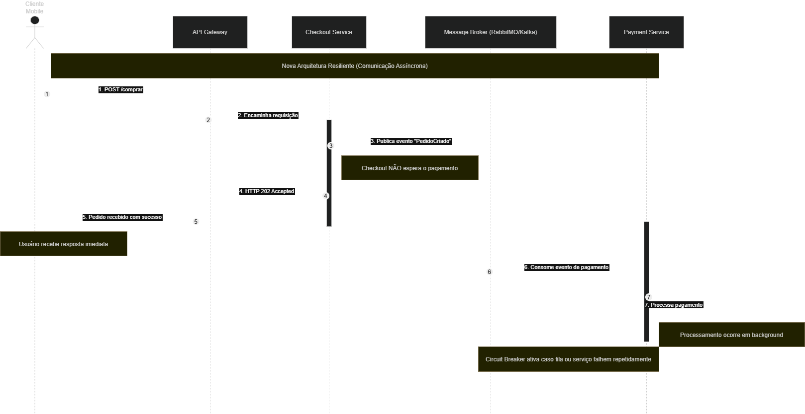

# Microsserviços II - Atividade Extra-Classe #

Nome do Aluno: Camilly Christine

Número de Matrícula: 2312301

# Objetivo da Atividade #

Esta atividade tem como objetivo aplicar conceitos de resiliência e tolerância a falhas em sistemas distribuídos, por meio do redesenho arquitetural de um fluxo de e-commerce. Atuando como Arquiteto de Software, a proposta busca solucionar problemas de escalabilidade e disponibilidade causados pela comunicação síncrona entre microsserviços.

## 1. Diagrama de Sequência ##

Diagrama de sequência da arquitetura resiliente proposta para o fluxo de checkout da ShopFast, utilizando API Gateway, mensageria assíncrona e Circuit Breaker para aumentar a disponibilidade e evitar falhas em cascata.

## 2. Justifricativa Técnica ##

A nova arquitetura foi projetada para aumentar a resiliência e evitar o efeito cascata causado pela comunicação síncrona entre os serviços. O API Gateway foi adicionado como ponto único de entrada, centralizando o roteamento e protegendo os microsserviços internos. Além disso, a integração entre Checkout e Pagamento passou a utilizar mensageria assíncrona por meio de uma fila (Message Broker), permitindo que o Checkout responda imediatamente ao cliente com HTTP 202 Accepted sem aguardar o processamento do pagamento. Dessa forma, mesmo que o serviço de Pagamento esteja lento ou indisponível, o Checkout permanece disponível e escalável. O principal trade-off adotado foi priorizar a disponibilidade do sistema em troca da consistência eventual, já que o pagamento não é confirmado em tempo real, mas processado posteriormente. O uso do padrão Circuit Breaker também contribui para a tolerância a falhas, interrompendo chamadas quando houver instabilidade nos serviços dependentes.
